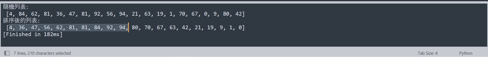

# python程式設計 期中報告   
11124114黃安德,  11124111王志節
## 生成包含20個亂數的列表
```
import random

random_list = [random.randint(0,100) for a in range(20)]
```
## 然後將前10個元素昇冪排列，後10個元素降冪排列，並輸出結果
```
first_half = random_list[:10]
second_half = random_list[10:]
first_half.sort()
second_half.sort(reverse=True)
result_list = first_half + second_half
print("隨機列表:\n", random_list)
print("排序後的列表:\n", result_list)
```
## 輸出結果


## 實作


